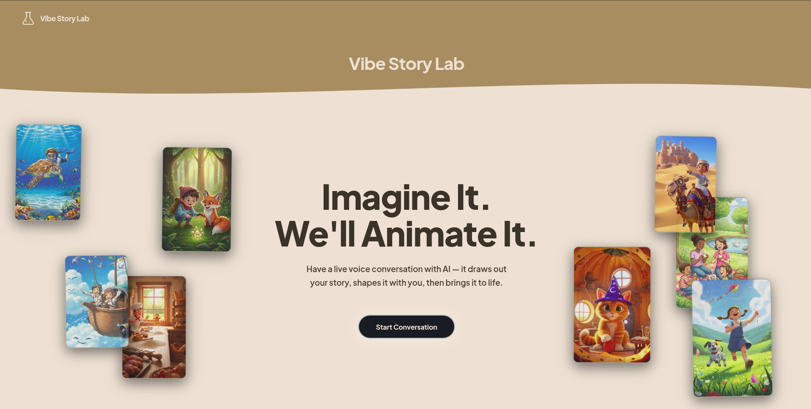
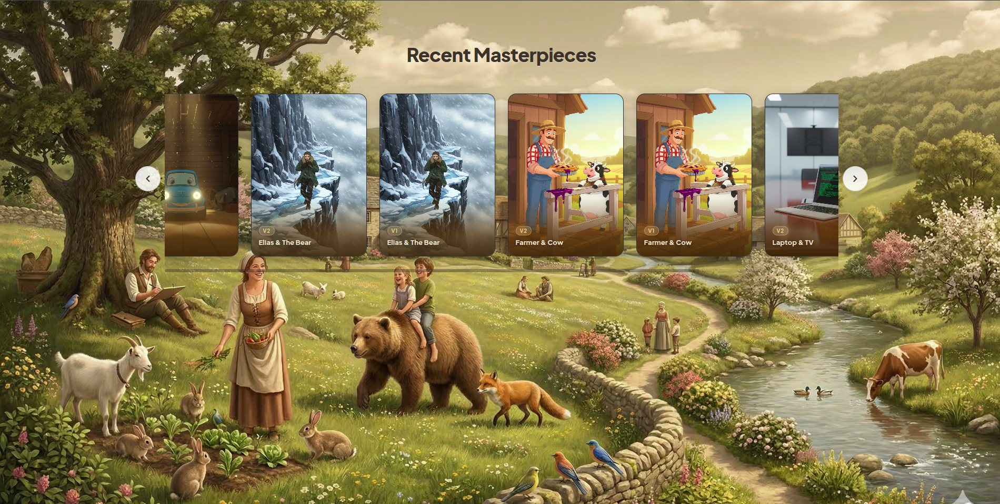
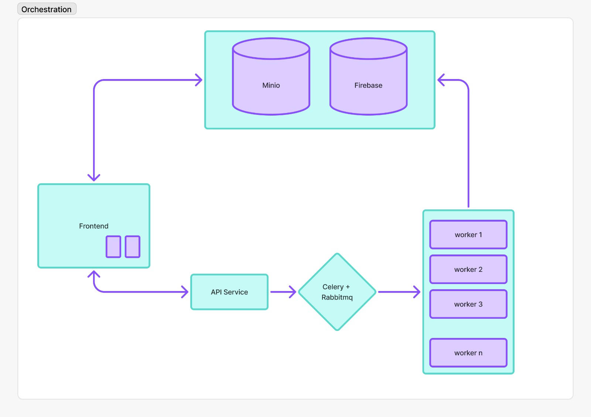
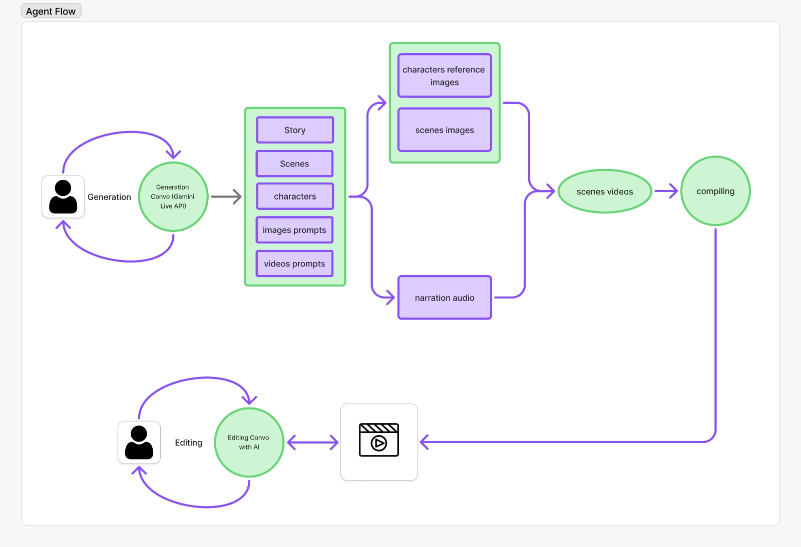
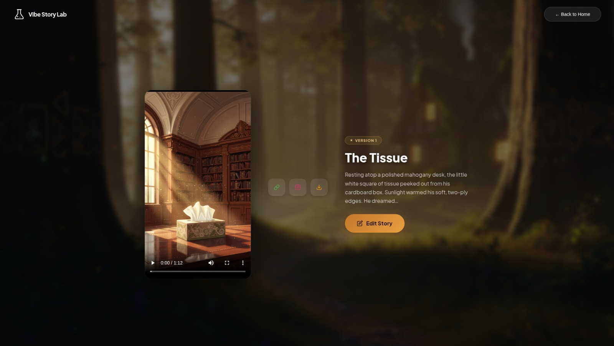

<div align="center">

<br/>

# 🧪 Vibe Story Lab

### *Your voice. Your world. Rendered in real-time without touhching your keyboard*

[](https://cloud.google.com/)
[](https://cloud.google.com/vertex-ai)
[](https://deepmind.google/technologies/gemini/)
[](https://google.github.io/adk-docs/)
[](LICENSE)

**An immersive AI agent that transforms live voice dialogue into cinematic, animated stories — in real-time.**
**Then lets you *refine every detail* through voice-driven editing with surgical precision.**

[](http://34.171.54.149:5173/)
[](https://github.com/akalabri/storyteller)

[🌐 Try It Live](http://34.171.54.149:5173/) · [✏️ Voice Editing](#-voice-driven-editing--the-killer-feature) · [🚀 Get Started](#-getting-started) · [🏗️ Architecture](#-architecture)

</div>

---

<div align="center">



*"Imagine It. We'll Animate It." — The landing experience where every story begins with a conversation.*

<br/>



*Stories created by real users, browsable from the landing page carousel.*

</div>

---

## 🔁 How It Works — Create, Watch, Refine usting just natural language through conversations

<div align="center">

| Step | What You Do | What Happens |
|:----:|:------------|:-------------|
| **1. 🎙️ Speak** | Have a live voice conversation with the AI about your story | Gemini Live captures your ideas through natural, interruptible dialogue |
| **2. 🎬 Watch** | Sit back while the pipeline generates your story | Characters, scenes, narration, and cinematic video are created in parallel |
| **3. ✏️ Refine** | Watch the video, then *talk* about what you'd like to change | A second voice session captures your edits — only the affected parts regenerate |

</div>

> **The edit loop is what makes Vibe Story Lab fundamentally different.** Most AI video tools give you one shot. We give you a *conversation* — an ongoing creative dialogue where you can iterate on your story as many times as you want, and the system is smart enough to only redo what changed.

---

## 📖 The Problem: Storytelling is Broken

Traditional digital storytelling is a **one-way street**. You type a prompt, wait, and receive a static output you had no hand in shaping. The audience is passive. The creator is reduced to a prompt engineer. The magic of *collaborative imagination* — the kind that happens when a parent and child build a bedtime story together — is completely lost.

**Vibe Story Lab** rewrites the rules. It is a **conversational AI agent** that sits across from you like a creative partner. You speak, it listens, it asks questions, it challenges your ideas, and together — through natural, interruptible voice dialogue — you co-create a rich, animated story complete with original characters, cinematic scenes, and a narrated soundtrack. The story isn't generated *for* you. It's generated *with* you.

Built on the **Gemini Live API** and orchestrated through the **Agent Development Kit (ADK)**, Vibe Story Lab proves that the future of content creation isn't about better prompts — it's about better *conversations*.

> **Category:** Creative Storyteller · **Challenge:** Gemini Live Agent Challenge

---

## ✨ Core Features

### 🎙️ Interruptible Live Interaction
Vibe Story Lab uses **Gemini Live** (`gemini-live-2.5-flash-native-audio`) for full-duplex, real-time voice conversation. Interrupt the AI mid-sentence. Change your mind. Redirect the plot. The agent adapts instantly — just like a human collaborator. No turn-taking, no "please wait."

### 🎨 Instant Visual Synthesis
The moment your conversation ends, a parallel pipeline activates:
- **Character sheets** are generated with consistent multi-angle references
- **Scene images** are composed with character-aware context
- **Cinematic video clips** bring each scene to life
- **Professional narration** is synthesized and synced with subtitles
- A **fully compiled video** is delivered — all within minutes

### 🔄 Distributed Pipeline with Celery + RabbitMQ
Every story generation and edit pipeline is **offloaded to Celery workers** via a RabbitMQ message broker. The FastAPI server never blocks — it publishes a task to the queue and immediately returns, while dedicated worker containers pick up the job and execute the full multi-phase pipeline independently. Workers run generation phases in parallel where possible and sequentially where required, with automatic retry logic, rate-limit backoff, and graceful fallback paths. Real-time progress is pushed back to the browser via WebSocket as each step completes.

---

## ✏️ Voice-Driven Editing — The Killer Feature

Most AI generation tools are **fire-and-forget**: you get one output and start over if you don't like it. Vibe Story Lab treats creation as an **iterative conversation**. After watching your generated story, you can refine it — *with your voice* — and the system surgically regenerates only what changed.

### How the Edit Loop Works

```
┌──────────────┐     ┌─────────────────────┐     ┌──────────────────┐
│  👤 User      │     │  🎙️ Edit Conversation │     │  🧠 Edit Agent    │
│  watches the  │────▶│  Agent (Gemini Live) │────▶│  (Gemini Pro)    │
│  video, taps  │     │  "What would you     │     │  Analyzes the    │
│  "Edit"       │     │   like to change?"   │     │  transcript and  │
└──────────────┘     └─────────────────────┘     │  produces an     │
                                                   │  EditPlan        │
                                                   └────────┬─────────┘
                                                            │
                                                            ▼
                                              ┌─────────────────────────┐
                                              │  📊 Dependency Graph     │
                                              │  Propagation             │
                                              │                          │
                                              │  Only dirty nodes are    │
                                              │  marked for regeneration │
                                              └────────────┬────────────┘
                                                           │
                                                           ▼
                                              ┌─────────────────────────┐
                                              │  🎯 Selective Pipeline   │
                                              │  Re-run                  │
                                              │                          │
                                              │  Changed scene? → redo   │
                                              │  its image + video only  │
                                              │  New character? → redo   │
                                              │  all scenes with them    │
                                              │  Wording tweak? → redo   │
                                              │  narration only          │
                                              └─────────────────────────┘
```

### The Dependency Graph

The edit system understands the **causal relationships** between every artifact in the pipeline. When you change something, it automatically propagates "dirtiness" downstream:

| You Change... | What Gets Regenerated |
|:--------------|:----------------------|
| A scene's story text | That scene's narration, image prompts, images, videos, and final video |
| A character's description | That character's reference sheet, **all** scene images and videos featuring them, and final video |
| A visual prompt | The affected scene image, its video, and final video |
| A scene image | Only the corresponding video clip and final video |
| Special instructions | The entire visual plan and all downstream assets |

This means if you say *"Make the dragon bigger in scene 2"*, the system doesn't re-render your entire story. It regenerates **only** scene 2's image, scene 2's video, and recompiles the final cut. Everything else stays untouched.

### Edit Conversation Flow

The edit experience mirrors the creation experience — it's a **live voice conversation**, not a text form:

1. **You tap "Edit"** on the story screen
2. **An Edit Conversation Agent** (Gemini Live) greets you and asks what you'd like to change
3. **You describe your edits naturally** — *"I want the castle to be darker"*, *"Change the boy's name to Leo"*, *"Make scene 3 more dramatic"*
4. **The agent confirms** your changes and asks if there's anything else
5. **When you're done**, the edit transcript is sent to the **Edit Agent** (Gemini Pro)
6. **The Edit Agent produces an `EditPlan`** — a structured diff containing updated story breakdown, updated visual plan, and a precise list of dirty nodes
7. **The orchestrator selectively re-runs** only the affected pipeline steps
8. **A new video is compiled** and delivered

---

## 🛠️ Tech Stack — Powered by Google

| Layer | Technology | Role |
|:------|:-----------|:-----|
| **🧠 Conversation** | [Gemini Live](https://ai.google.dev/) (`gemini-live-2.5-flash-native-audio`) | Real-time, interruptible voice dialogue |
| **📝 Story Intelligence** | [Gemini 3.1 Pro](https://deepmind.google/technologies/gemini/) (`gemini-3.1-pro-preview`) | Story breakdown, scene planning, edit analysis |
| **🖼️ Image Generation** | [Gemini Flash Image](https://ai.google.dev/) (`gemini-2.5-flash-image-preview`) | Character sheets & scene illustrations (2K, 9:16) |
| **🎬 Video Generation** | [Veo 3.1](https://deepmind.google/technologies/veo/) (`veo-3.1-generate-001`) | Cinematic scene clips with reference images |
| **🗣️ Narration** | [ElevenLabs](https://elevenlabs.io/) (`eleven_multilingual_v2`) | Professional multilingual TTS |
| **🤖 Agent Framework** | [Agent Development Kit (ADK)](https://google.github.io/adk-docs/) | Agent orchestration and tooling |
| **☁️ Infrastructure** | [Vertex AI](https://cloud.google.com/vertex-ai) on GCP | Model orchestration, auth, and serving |
| **📬 Task Queue** | [Celery](https://docs.celeryq.dev/) + [RabbitMQ](https://www.rabbitmq.com/) | Distributed task queue — every pipeline run is offloaded to workers |
| **👷 Workers** | Celery Workers (Docker containers) | Execute generation/edit pipelines independently from the API server |
| **📦 Storage** | [Google Cloud Storage](https://cloud.google.com/storage) + MinIO | Veo I/O + local artifact persistence |
| **🐳 Deployment** | [Google Cloud Compute Engine](https://cloud.google.com/compute) + Docker Compose | Production instance on GCP with containerized services |
| **🔄 CI/CD** | [GitHub Actions](https://github.com/features/actions) | Auto-deploy on every merge to `main` via self-hosted runner |
| **🗄️ Database** | [Firebase](https://firebase.google.com/) by Google | Session, story, and analytics persistence |
| **⚡ Backend** | FastAPI + Uvicorn | Async REST + WebSocket server |
| **🖥️ Frontend** | Vite + TypeScript | Lightweight, zero-framework SPA |

### 🧪 The "Vibe Coding" Advantage

The **Agent Development Kit (ADK)** allowed us to focus on *crafting the experience* rather than wrestling with boilerplate integration code. By leveraging ADK's agent abstractions alongside `google-genai` for direct Vertex AI access, we could rapidly prototype a multi-agent pipeline where each agent — conversation, story, image, video, narration, compilation — operates as an independent, composable unit. The result: a codebase that reads like a creative brief, not an infrastructure manual.

---

## 🏗️ Architecture

### System Orchestration

<div align="center">



*Frontend → API Service → Celery + RabbitMQ → Scalable Workers → MinIO & Firebase*

</div>

### Agent Pipeline Flow

<div align="center">



*The full generation pipeline (top) and the voice-driven edit loop (bottom) — showing how conversation flows through story breakdown, asset generation, and compilation.*

</div>

```
┌─────────────────────────────────────────────────────────────────────┐
│                         👤 USER (Browser)                           │
│          Voice Input (PCM 16kHz) ←→ Audio Output (PCM 24kHz)       │
│          Real-time progress updates via WebSocket                   │
└──────────────────────────┬──────────────────────────────────────────┘
                           │ WebSocket (binary + JSON)
                           ▼
┌─────────────────────────────────────────────────────────────────────┐
│                     ⚡ FastAPI Backend (API Server)                  │
│                                                                     │
│  ┌─────────────────────────────────────────────────────────────┐    │
│  │  🎙️ Conversation Agent — Gemini Live (full-duplex audio)    │    │
│  │  Transcript saved → StoryState                              │    │
│  └─────────────────────────┬───────────────────────────────────┘    │
│                             │                                       │
│            POST /api/story/generate                                 │
│            POST /api/story/{id}/edit-from-transcript                │
│                             │                                       │
│                    ┌────────▼────────┐                              │
│                    │  Publish task   │                              │
│                    │  to RabbitMQ    │                              │
│                    └────────┬────────┘                              │
│                             │  (returns immediately)                │
└─────────────────────────────┼───────────────────────────────────────┘
                              │
                    ┌─────────▼─────────┐
                    │   🐇 RabbitMQ     │
                    │   Message Broker  │
                    │                   │
                    │  generate_story   │
                    │  edit_story       │
                    │  retry_pipeline   │
                    └────┬─────────┬────┘
                         │         │
              ┌──────────▼┐  ┌────▼──────────┐
              │ 👷 Worker │  │ 👷 Worker     │    (scalable — add more
              │    #1     │  │    #2         │     containers as needed)
              └─────┬─────┘  └──────┬────────┘
                    │               │
                    ▼               ▼
┌─────────────────────────────────────────────────────────────────────┐
│                  🎯 Pipeline Orchestrator (inside worker)           │
│                                                                     │
│   ┌──────────┐    Phase 1 (parallel)                                │
│   │  Story   │──┬──▶ [Narration Agent × N]   → MP3 audio           │
│   │  Agent   │  └──▶ [Character Agent × M]   → PNG sheets          │
│   └──────────┘                                                      │
│        │           Phase 2                                          │
│        └──────────▶ [Scene Prompt Agent]      → Visual Plan         │
│                                                                     │
│                    Phase 3 (concurrent)                              │
│                     [Scene Image Agent × K]   → PNG scenes          │
│                                                                     │
│                    Phase 4 (concurrent, gated on images)            │
│                     [Scene Video Agent × K]   → MP4 clips           │
│                                                                     │
│                    Phase 5                                          │
│                     [Compile Agent]            → Final MP4          │
│                                                                     │
│   Progress events → WebSocket → Browser (real-time updates)        │
└─────────────────────────────────────────────────────────────────────┘
                              │
         ┌────────────────────┼─────────────────────┐
         ▼                    ▼                     ▼
  ┌────────────┐  ┌──────────────────┐  ┌──────────────────┐
  │ Gemini 3.1 │  │    Veo 3.1       │  │   ElevenLabs     │
  │ Pro / Flash │  │   (Video)        │  │    (TTS)         │
  │  Vertex AI │  │   Vertex AI      │  │                  │
  └────────────┘  └──────────────────┘  └──────────────────┘

         ┌────────────────────┼─────────────────────┐
         ▼                    ▼                     ▼
  ┌────────────┐  ┌──────────────────┐  ┌──────────────────┐
  │  Firebase  │  │      MinIO       │  │       GCS        │
  │   (DB)     │  │    (Assets)      │  │   (Veo I/O)     │
  └────────────┘  └──────────────────┘  └──────────────────┘
```

### Why Celery + RabbitMQ?

Story generation is **compute-heavy and long-running** — a single pipeline can take several minutes, calling multiple AI models across 5 phases. Without a task queue, the API server would be blocked and unable to serve other users. With Celery:

- **The API server stays fast** — it publishes a message and returns instantly
- **Multiple stories generate simultaneously** — each worker picks up a task independently
- **Workers scale horizontally** — spin up more containers to handle more concurrent users
- **Failures are isolated** — a crashed pipeline doesn't take down the API or other users' jobs
- **Retries are built-in** — Celery's retry mechanism complements the per-agent retry logic

### Data Flow

1. **Voice In** → Browser captures PCM audio at 16 kHz and streams it over WebSocket
2. **Gemini Live** → Full-duplex conversation with the AI; transcript is accumulated in real-time
3. **Task Published** → FastAPI publishes a `generate_story` task to RabbitMQ and returns the session ID
4. **Worker Picks Up** → A Celery worker dequeues the task and starts the pipeline orchestrator
5. **Story Agent** → Gemini 3.1 Pro decomposes the transcript into scenes, characters, and props
6. **Parallel Generation** → Narration (ElevenLabs) and character images (Gemini Flash) run simultaneously
7. **Visual Planning** → Gemini 3.1 Pro generates detailed image and video prompts per sub-scene
8. **Scene Rendering** → Gemini Flash produces scene images; Veo 3.1 generates cinematic video clips
9. **Compilation** → FFmpeg assembles narration, video clips, subtitles, and background music into the final MP4
10. **Delivery** → Progress events stream to the browser via WebSocket throughout the entire process

---

## 🚀 Getting Started

You can try the **[live demo](http://34.171.54.149:5173/)** instantly, or run the full stack locally with Docker Compose.

### Prerequisites

| Requirement | Version | Notes |
|:------------|:--------|:------|
| **OS** | Ubuntu 22.04+ | Tested on Ubuntu; macOS/WSL2 should also work |
| **Docker** & **Docker Compose** | Latest | Only requirement for the Docker path |
| **GCP Service Account Key** | — | With Vertex AI and Cloud Storage permissions |
| **ElevenLabs API Key** | — | For narration / TTS |

> **That's it.** Python, Node.js, FFmpeg, and all other dependencies are handled inside the Docker containers — you don't need to install them on your host machine.

---

### Step 1 — Clone the Repository

```bash
git clone https://github.com/akalabri/storyteller.git
cd storyteller
```

### Step 2 — Get Your API Keys

You'll need three things before running the app:

| Key | Where to Get It | Required? |
|:----|:----------------|:----------|
| **GCP Service Account Key** | [GCP Console → IAM → Service Accounts → Keys](https://console.cloud.google.com/iam-admin/serviceaccounts) | Yes |
| **ElevenLabs API Key** | [elevenlabs.io/app/settings](https://elevenlabs.io/app/settings/api-keys) | Yes |
| **FAL API Key** | [fal.ai/dashboard](https://fal.ai/dashboard/keys) | Optional (fallback for Veo) |

**GCP Service Account permissions needed:**
- Vertex AI User
- Cloud Storage Object Admin (for the Veo bucket)

Save the service account key JSON file as **`key.json`** in the project root.

### Step 3 — Configure Environment

```bash
cp .env.example .env
```

Open `.env` and fill in your values:

```env
# ── Google Cloud / Vertex AI ─────────────────────────────────
GOOGLE_API_KEY=your-google-api-key
GOOGLE_APPLICATION_CREDENTIALS="key.json"
GOOGLE_CLOUD_PROJECT=your-gcp-project-id
GOOGLE_CLOUD_LOCATION=us-central1
GOOGLE_GENAI_USE_VERTEXAI=true

# ── Veo (Video Generation) ──────────────────────────────────
VEO_BUCKET=your-veo-bucket-name

# ── ElevenLabs (Narration) ──────────────────────────────────
ELEVENLABS_API_KEY=your-elevenlabs-api-key

# ── FAL (Optional fallback for Veo) ─────────────────────────
FAL_API_KEY=your-fal-api-key
```

> The `.env.example` file contains all available options with descriptions. MinIO and pipeline settings have sensible defaults and don't need to be changed for a standard setup.

### Step 4 — Launch with Docker Compose

```bash
docker compose up --build
```

Docker Compose builds and starts all services automatically:

```
 ✔ Container rabbitmq              Started    ← Message broker for task queue
 ✔ Container minio                 Started    ← S3-compatible artifact storage
 ✔ Container storyteller-backend   Started    ← FastAPI + WebSocket server
 ✔ Container storyteller-worker    Started    ← Celery worker (pipeline executor)
 ✔ Container storyteller-frontend  Started    ← Vite dev server
```

| Service | URL | Description |
|:--------|:----|:------------|
| **Frontend** | [http://localhost:5173](http://localhost:5173) | Main app — start here |
| **Backend API** | [http://localhost:8000](http://localhost:8000) | REST + WebSocket endpoints |
| **RabbitMQ Management** | [http://localhost:15672](http://localhost:15672) | Queue monitoring dashboard (login: `guest` / `guest`) |
| **MinIO Console** | [http://localhost:9003](http://localhost:9003) | Browse stored artifacts (login: `minio` / `minio1234`) |

### Step 5 — Create Your First Story

1. Open **[http://localhost:5173](http://localhost:5173)** in your browser
2. Click **"Create Story"**
3. **Allow microphone access** when prompted
4. **Start talking** — describe your story idea to the AI
5. When you're done, the pipeline generates your video automatically
6. Watch it, then tap **"Edit Story"** to refine with your voice

<div align="center">



*Your finished story: a cinematic video with narration, subtitles, and an "Edit Story" button to start the voice-driven edit loop.*

</div>

---

### Local Development (without Docker)

If you prefer running services directly on your host for faster iteration:

```bash
# Install system dependencies
sudo apt-get update && sudo apt-get install -y ffmpeg

# Install uv (fast Python package manager)
curl -LsSf https://astral.sh/uv/install.sh | sh

# Backend (terminal 1)
uv sync
uv run python -m backend.main

# Frontend (terminal 2)
cd frontend
npm install
npm run dev
```

> **Note:** When running without Docker, you'll need to start RabbitMQ and MinIO separately (or point `CELERY_BROKER_URL` and `MINIO_ENDPOINT` to existing services). You'll also need Python 3.11+, Node.js 18+, and FFmpeg installed on your host. Start the Celery worker in a third terminal: `uv run celery -A backend.tasks.celery_app worker --loglevel=info`

---

## ☁️ Deployment & CI/CD

Vibe Story Lab is **live in production** on a Google Cloud Compute Engine instance:

> **🌐 Live Demo: [http://34.171.54.149:5173/](http://34.171.54.149:5173/)**

### Continuous Deployment

The project implements a fully automated CI/CD pipeline using **GitHub Actions** with a **self-hosted runner** on the GCP instance. The workflow is simple and reliable:

1. **Developer pushes** code and opens a pull request to `main`
2. **PR is reviewed and merged** into `main`
3. **GitHub Actions triggers automatically** on merge
4. **The self-hosted runner** (on the GCP instance) pulls the latest code, rebuilds all Docker containers, and restarts services — **zero-downtime redeployment**

```
Developer → Pull Request → Merge to main → GitHub Actions → Self-hosted Runner on GCP
                                                                    │
                                                          docker compose down
                                                          docker compose build
                                                          docker compose up -d
                                                                    │
                                                              ✅ Live at
                                                        34.171.54.149:5173
```

Every merge to `main` is a production deploy. No manual SSH, no manual restarts, no intervention required.

---

## 📂 Project Structure

```
storyteller/
├── backend/
│   ├── agents/                      # AI agent modules
│   │   ├── conversation_agent.py         # Gemini Live voice bridge
│   │   ├── story_agent.py                # Transcript → story breakdown
│   │   ├── character_agent.py            # Character sheet generation
│   │   ├── scene_prompt_agent.py         # Visual planning
│   │   ├── scene_image_agent.py          # Scene illustration
│   │   ├── scene_video_agent.py          # Veo cinematic clips
│   │   ├── narration_agent.py            # ElevenLabs TTS
│   │   ├── compile_agent.py              # FFmpeg final assembly
│   │   ├── edit_agent.py                 # Edit planning & dirty propagation
│   │   └── edit_conversation_agent.py    # Edit voice conversation bridge
│   ├── pipeline/
│   │   ├── orchestrator.py               # Async pipeline engine
│   │   └── state.py                      # StoryState schema
│   ├── tasks/
│   │   ├── celery_app.py                 # Celery app + RabbitMQ broker config
│   │   └── story_tasks.py               # Task definitions (generate, edit, retry)
│   ├── db/                               # Firebase models & CRUD
│   ├── utils/                            # GCS, MinIO, retry logic
│   ├── main.py                           # FastAPI entry point
│   └── config.py                         # Centralized configuration
├── frontend/
│   ├── src/
│   │   ├── screens/                      # Landing, Conversation, Story, Edit
│   │   └── utils/                        # API client, audio bridge, state
│   └── package.json
├── docker-compose.yml
├── pyproject.toml
└── .env.example
```

---

## 🔮 Future Vision

Vibe Story Lab is a proof of concept for a much larger idea: **conversational content creation**.

- **🎓 Education** — Imagine a child describing a historical event and watching it come to life as an animated documentary. Teachers could use voice-driven story generation to create personalized lesson content in minutes, not hours.

- **🎮 Interactive Gaming** — The same pipeline that generates stories could power procedurally generated game narratives where every player's world is unique, shaped entirely by their voice.

- **♿ Accessibility** — Voice-first interfaces remove barriers for creators who can't type, draw, or use traditional creative tools. Storytelling becomes universal.

- **🌍 Multilingual Expansion** — With Gemini's multilingual capabilities and ElevenLabs' voice cloning, stories could be co-created and rendered in any language, preserving cultural nuance.

- **🎵 Generative Soundtracks** — Future integration with **Lyria** for AI-composed background scores that dynamically match each scene's emotional tone.

The long-term vision: a world where anyone with a voice can produce studio-quality animated content — no technical skills required.

---

## 🏆 Built For

<div align="center">

**Gemini Live Agent Challenge — Creative Storyteller Category**

*Demonstrating the power of real-time, multimodal AI agents built on Google's ecosystem.*

[](https://cloud.google.com/)
[](https://cloud.google.com/vertex-ai)
[](https://deepmind.google/technologies/gemini/)

</div>

---

## 📄 License

This project is licensed under the MIT License — see the [LICENSE](LICENSE) file for details.

---

<div align="center">

**Vibe Story Lab** — *Where imagination finds its voice.*

</div>
